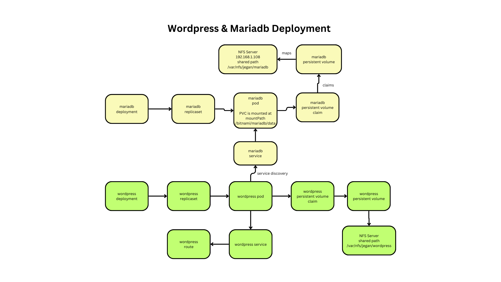

# Day 3

## Lab - Deploying an application using source strategy from command line
```
oc new-app registry.access.redhat.com/ubi8/openjdk-11~https://github.com/tektutor/openshift-june-2024.git --context-dir=Day2/hello-microservice --strategy=source
```

To check the build log
```
oc logs -f buildconfig/openshift-june-2024
```

We need manually create route
```
oc expose svc/openshift-june-2024
```

You may access the route url to check the output from the microservice
```
curl http://http://openshift-june-2024-jegan.apps.ocp4.tektutor.org.labs
```

Expected output


## Lab - Deploying application using existing docker image
```
oc new-project jegan
oc new-app --name=nginx --image=bitnami/nginx:latest
oc expose svc/nginx
oc get route
curl http://nginx-jegan.apps.ocp4.tektutor.org.labs
```

Expected output


## Lab - Finding list of red hat container image options available for a programming language stack
```
oc new-app --search java
oc new-app --search python
oc new-app --search dotnet
oc new-app --search ruby
oc new-app --search php
oc new-app --search nodejs
oc new-app --search angular
oc new-app --search react
```

Expected output


## Lab - Deploying nginx in declarative style
```
oc delete project jegan
oc new-project jegan
oc create deployment nginx --image=bitnami/nginx:1.18 --replicas=3 -o yaml --dry-run=client
oc create deployment nginx --image=bitnami/nginx:1.18 --replicas=3 -o yaml --dry-run=client > nginx-deploy.yml
cat nginx-deploy.yml

oc create -f nginx-deploy.yml
oc get deploy,rs,po
```

Expected output


## Lab - Scale up/down deployment in declarative style

You may edit the nginx-deploy.yml and update the replicas from 3 to 5, save it and apply the changes as shown below
```
cat nginx-deploy.yml
oc apply -f nginx-deploy.yml
oc get po
oc get po -w
oc get po
```

Expected output


## Lab - Deploying replicaset in declarative style
```
oc get rs
oc get rs -o yaml
oc get rs -o yaml > nginx-rs.yml
vim nginx-rs.yml
cat nginx-rs.yml
oc create -f nginx-rs.yml
oc get deploy
oc get rs,po
```

Expected output


#### Points to note
<pre>
- Though creating a replicaset without deployment is possible, it is not a best practice
- Without deployment, we won't get self-healing for replicaset, hence if the replicaset is deleted all the pods will be deleted
- the other reason, why this isn't a best practice is, we won't be able to perform rolling update as there is no deployment. Only scale up/down is possible
- Hence, always consider using deployment
</pre>  

## Lab - When to use oc create vs oc apply?
<pre>
- oc create should be used when the deployment doesn't exist in the cluster already 
- once the deployment is created in the cluster, we can't use create anymore, we can only use apply
- apply will update the delta changes done in the yml on the existing deployment resource in the openshift cluster
</pre>

Expected output


## Lab - Creating a Pod in declarative style
Delete the existing replicaset and associated pods before proceeding
```
cd ~/openshift-june-2024
git pull
cd Day3/declarative-manifest-scripts
oc delete -f nginx-rs.yml
```

Let's create the pod in declarative style
```
cat my-pod.yml
oc create -f my-pod.yml
oc get po
oc get po -w
```

Expected output


## Lab - Creating clusterip internal service in declarative style

First let's delete any existing deployments, replicasets, pod in declarative style
```
cd ~/openshift-june-2024
git pull
cd Day3/declarative-manifest-scripts
oc delete -f pod.yml
oc delete -f nginx-rs.yml
oc delete -f nginx-deploy.yml
oc get all
```

Let's now create then nginx deployment in declarative style and create a clusterip internal service also in declarative style
```
cd ~/openshift-june-2024
git pull
cd Day3/declarative-manifest-scripts

oc create -f nginx-deploy.yml
oc expose deploy/nginx --type=ClusterIP --port=8080 -o yaml --dry-run=client
oc expose deploy/nginx --type=ClusterIP --port=8080 -o yaml --dry-run=client > nginx-clusterip-svc.yml
oc create -f nginx-clusterip-svc.yml
oc get svc
oc get describe svc/nginx
```

Expected output


## Lab - Creating a nodeport external service in declarative style

First we need to delete the nginx clusterip service
```
cd ~/openshift-june-2024
git pull
cd Day3/declarative-manifest-scripts
oc delete -f nginx-clusterip-svc.yml
oc get svc
```

Let's create the nodeport service for existing nginx deployment
```
oc get deploy
oc expose deploy/nginx --type=NodePort --port=8080 -o yaml --dry-run=client
oc expose deploy/nginx --type=NodePort --port=8080 -o yaml --dry-run=client > nginx-nodeport-svc.yml
oc create -f nginx-nodeport-svc.yml
oc get svc
oc describe svc/nginx
```

Expected output


## Lab - Creating a loadbalancer service for existing nginx deployment in declararive style

First we need to delete existing nodeport service
```
cd ~/openshift-june-2024
git pull
cd Day3/declarative-manifest-scripts
oc delete -f nginx-nodeport-svc.yml
oc get svc
```

Let's create the loadbalancer service for nginx deployment in declarative style 
```
cd ~/openshift-june-2024
git pull
cd Day3/declarative-manifest-scripts
oc expose deploy/nginx --port=8080 --type=LoadBalancer -o yaml --dry-run=client
oc expose deploy/nginx --port=8080 --type=LoadBalancer -o yaml --dry-run=client > nginx-lb-svc.yml
oc create -f nginx-lb-svc.yml
oc get svc
curl http://192.168.122.90:8080
```

Expected output


## Lab - Rolling update in declarative style
```
oc get deploy
oc get po
oc get po/nginx-566b5879cb-pmhzb -o yaml | grep image
cat nginx-deploy.yml| grep image
oc apply -f nginx-deploy.yml
oc get rs
oc rollout status deploy/nginx
oc rollout history deploy/nginx
```

Expected output


## Lab - Declaratively deploying application from Openshift webconsole


## Lab - Deleting a deployment from openshift webconsole


## Lab - Deploying mysql with Persistent Volume

#### Points to note
<pre>
- Persistent Volume is an external storage created by System Administrator
- Persistent Volumes can be provisioned by System Administrators
  - Manually ( By defining Persisten Volumes in a yaml file and apply )
  - Dynamically ( Storage Class )
- Persistent Volumes
  - will have a size in MB/GB
  - Will have AccessModes
  - will have Storage Class (optionally)
- Persitent volumes are available for any applications cluster-wide

- Application that require external storage will have ask for storage by defining PersistentVolumeClaim
  - Claim will have to mention
  - What is the size required?
  - What is the accessMode required?
  - Storage Class ( optionally)
  - PVC is defined by the development
- Openshift Storage Controller will search the cluster for matching PersistentVolume as per the PersistentVolumeClaim requirement, if it finds a match then, it will let the PVC go and bound the PV and use it any application deployment
</pre>


```
cd ~/openshift-june-2024
git pull
cd Day3/persistent-volume
cat mysql-pv.yml
showmount -e
oc apply -f mysql-pv.yml
oc get persistentvolumes
oc get persistentvolume
oc get pv

cat mysql-pvc.yml
oc apply -f mysql-pvc.yml
oc get persistentvolumeclaims
oc get persistentvolumeclaim
oc get pvc

cat mysql-deploy.yml
oc apply -f mysql-deploy.yml
oc get deploy
oc get po -w
```

Expected output


## Lab - Deploying wordpress and mariadb multi-pod application in declarative style


```
cd ~/openshift-june-2024
git pull
cd Day3/persistent-volume/wordpress
oc apply -f mariadb-pv.yml
oc apply -f mariadb-pvc.yml
oc apply -f mariadb-deploy.yml
oc apply -f mariadb-svc.yml

oc apply -f wordpress-pv.yml
oc apply -f wordpress-pvc.yml
oc apply -f wordpress-deploy.yml
oc apply -f wordpress-svc.yml
oc apply -f wordpress-route.yml

oc get po
oc logs mariadb-5b9895469b-mqhbl
oc logs wordpress-98c9cb676-k7hvk

oc get route
```


Expected output


Once you are done with the lab exercise, you may delete the wordpress and mariadb in the reverse order
```
cd ~/openshift-june-2024
git pull
cd Day3/persistent-volume/wordpress
oc delete -f wordpress-route.yml
oc delete -f wordpress-svc.yml
oc delete -f wordpress-deploy.yml
oc delete -f wordpress-pvc.yml
oc delete -f wordpress-pv.yml

oc delete -f mariadb-svc.yml
oc delete -f mariadb-deploy.yml
oc delete -f mariadb-pvc.yml
oc delete -f mariadb-pv.yml
```

Expected output


## Lab - Wordpress & Mariadb Multi Pod application fetching values from configmap and secret
#### Points to note
<pre>
- configmap can be used to store environment variables, tools path, etc
- configmap stores them as key-value pair
- the information stored in configmap should be non-sensitive in nature
- in case, you wish to store any sensitive information like password, you can use secret for the same
- secret also internally stores the data in the form of key-value pair just like configmap
- secret won't reveal the value stores
- we need to provide the values as a base64 encoded string
</pre>


Make sure the wordpress and mysql deployed earlier are deleted before proceeding
```
cd ~/openshift-june-2024
git pull
cd Day3/persistent-volume/wordpress
oc delete -f wordpress-route.yml
oc delete -f wordpress-svc.yml
oc delete -f wordpress-deploy.yml
oc delete -f wordpress-pvc.yml
oc delete -f wordpress-pv.yml

oc delete -f mariadb-svc.yml
oc delete -f mariadb-deploy.yml
oc delete -f mariadb-pvc.yml
oc delete -f mariadb-pv.yml

cd ../mysql
oc delete -f mysql-deploy.yml
oc delete -f mysql-pvc.yml
oc delete -f mysql-pv.yml
```


Now you may proceed deploying mariadb and wordpress as shown below
```
cd ~/openshift-june-2024
git pull
cd Day3/persistent-volume/wordpress-with-configmap-and-secret
cat wordpress-cm.yml
cat wordpress-secret.yml
cat mariadb-deploy.yml
cat wordpress-deploy.yml

oc apply -f wordpress-cm.yml
oc apply -f wordpress-secret.yml
oc apply -f mariadb-pv.yml
oc apply -f mariadb-pvc.yml
oc apply -f mariadb-deploy.yml
oc apply -f mariadb-svc.yml

oc apply -f wordpress-pv.yml
oc apply -f wordpress-pvc.yml
oc apply -f wordpress-deploy.yml
oc apply -f wordpress-svc.yml
oc apply -f wordpress-route.yml
```

Expected output


## Lab - Deploying redis with persistent volume
```
cd ~/openshift-june-2024
git pull
cd Day3/persistent-volume/redis
showmount -e
cat redis-pv.yml
cat redis-pvc.yml
cat redis-deploy.yml

oc apply -f redis-pv.yml
oc apply -f redis-pvc.yml
oc apply -f redis-deploy.yml

oc get po
oc logs redis-c7bf8bd5-xf2ng
```

Expected output


## Lab - Deploying mongodb with Persistent volume
```
cd ~/openshift-june-2024
git pull
cd Day3/persistent-volume/mongodb
cat mongodb-pv.yml
cat mongodb-pvc.yml
cat mongodb-deploy.yml
oc apply -f mongodb-pv.yml
oc apply -f mongodb-pvc.yml
oc apply -f mongodb-deploy.yml
oc get po -w
oc get po
oc logs 
```

Expected output


## Lab - Running a one time task as an Openshift Job
```
cd ~/openshift-june-2024
git pull
cd Day3/job
cat job.yml
oc apply -f job.yml
oc get jobs
oc logs -f job/hello-job
```

## Lab - Running recurring CronJob at a specified time
```
cd ~/openshift-june-2024
git pull
cd Day3/cronjob
cat cronjob.yml
oc apply -f cronjob.yml
oc get cronjobs
oc get po
oc logs -f cron-job-28657823-p6bgx
```

Expected output
<pre>
jegan@tektutor.org $ oc apply -f cronjob.yml
cronjob.batch/cron-job configured
  
jegan@tektutor.org $ oc get po -w
NAME                      READY   STATUS      RESTARTS   AGE
cron-job-28657815-fnqbl   0/1     Completed   0          6m56s
hello-job-km8pg           0/1     Completed   0          47m
pause-5df6b47b66-zjvpl    1/1     Running     0          49m
cron-job-28657823-p6bgx   0/1     Pending     0          0s
cron-job-28657823-p6bgx   0/1     Pending     0          0s
cron-job-28657823-p6bgx   0/1     Pending     0          0s
cron-job-28657823-p6bgx   0/1     ContainerCreating   0          0s
cron-job-28657823-p6bgx   0/1     ContainerCreating   0          0s
cron-job-28657823-p6bgx   0/1     Completed           0          3s
cron-job-28657823-p6bgx   0/1     Completed           0          4s
cron-job-28657823-p6bgx   0/1     Completed           0          5s
cron-job-28657823-p6bgx   0/1     Completed           0          5s
  
jegan@tektutor.org $ oc logs -f cron-job-28657823-p6bgx
Hello  
</pre>
