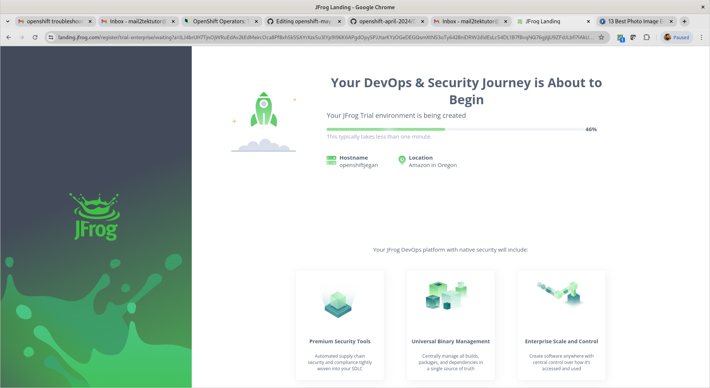
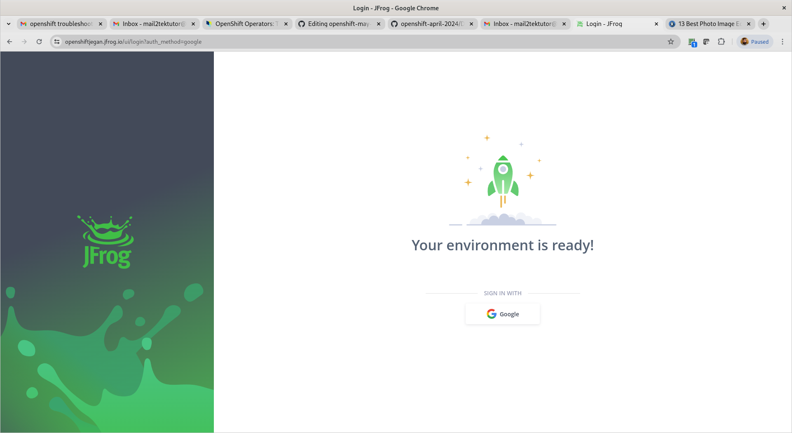
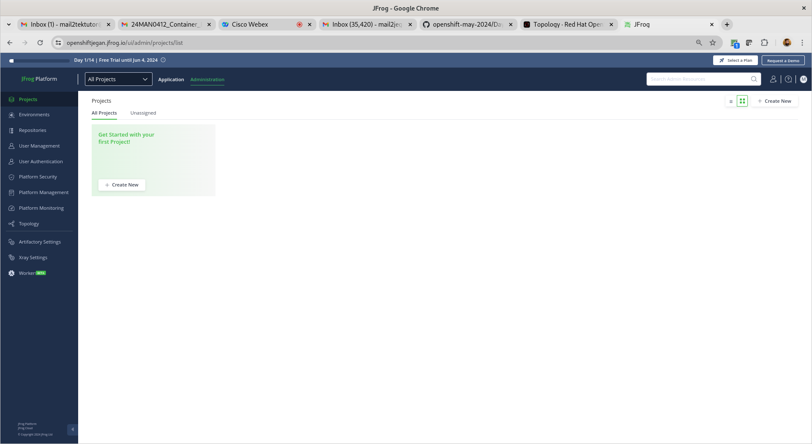
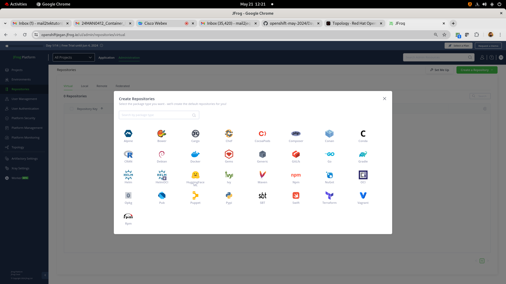
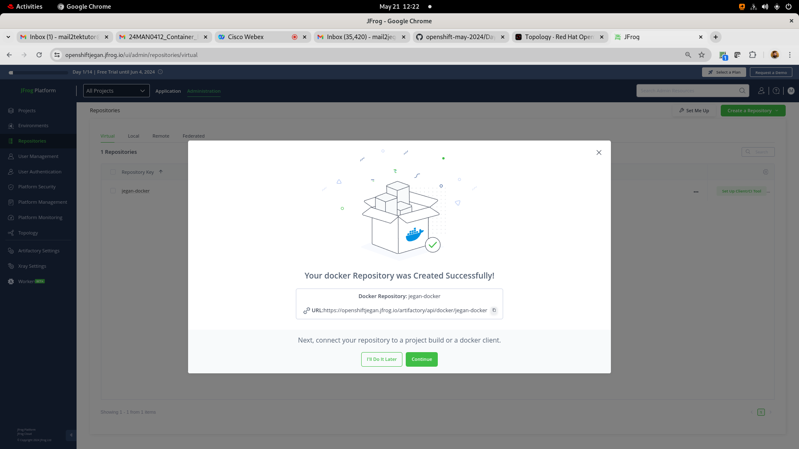

# Day 4

## Info - Helm Overview
<pre>
- Just we have package manage in Linux distributions
  - apt-get in ubuntu
  - yum in Red Hat based Linux distributions
- helm  is a package manager for Kubernetes and Openshift 
- using helm we can install, uninstall, ugrade applications into Kubernetes and Openshift
- helm works just like oc or kubectl outside the cluster as a client tool
- using helm we can package our yaml manifest scripts in a specific format called Helm Chart
- Helm chart is a compressed file which can distribute to your customers
- Using the Helm chart, your customer can install your application into Kubernetes and Openshift
- There is a community maintained Helm chart portal is there, you can download charts other people developed and published
</pre>

## Lab - Creating a custom helm chart to package the wordpress & mariadb multipod application
```
cd ~/openshift-june-2024
git pull
cd Day4/helm
helm create wordpress
tree wordpress
cd wordpress/templates
rm -rf *
cd ..
echo "" > values.yaml
cp ../scripts/*.yml templates
cp ../values.yaml .
cd ..
helm package wordpress
ls -l
helm install wordpress wordpress-0.1.0.tgz
helm list
```

Expected output


## Info - Installing openssl ( is already installed in our lab - just for your future reference )

Installing openssl from source code ( Already installed on Lab machines, so kindly skip this installation)
```
sudo yum -y remove openssl openssl-devel
sudo yum groupinstall 'Development Tools'
sudo yum install perl-IPC-Cmd perl-Test-Simple -y
cd /usr/src
wget https://www.openssl.org/source/openssl-3.3.1.tar.gz
tar -zxf openssl-3.3.1.tar.gz
rm openssl-3.3.1.tar.gz
cd /usr/src/openssl-3.3.1
./config
make
make test
make install

sudo ln -s /usr/local/lib64/libssl.so.3 /usr/lib64/libssl.so.3
sudo ln -s /usr/local/lib64/libcrypto.so.3 /usr/lib64/libcrypto.so.3

sudo ldconfig
sudo tee /etc/profile.d/openssl.sh<<EOF
export PATH=/usr/local/bin:$PATH
export LD_LIBRARY_PATH=/usr/local/openssl/lib:/usr/local/openssl/lib64:$LD_LIBRARY_PATH
EOF

which openssl
openssl version
```

## Demo - Install Operator SDK
```
su -
wget https://go.dev/dl/go1.18.2.linux-amd64.tar.gz
tar xvfz go1.18.2.linux-amd64.tar.gz
pwd
export PATH=/root/go/bin:$PATH
```

To apply the .bashrc changes
```
source ~/.bashrc
```

Check the golang version
```
go version
```
Install Openshift operator SDK
```
wget https://mirror.openshift.com/pub/openshift-v4/x86_64/clients/operator-sdk/4.10.12/operator-sdk-linux-x86_64.tar.gz
tar xvf operator-sdk-linux-x86_64.tar.gz
mv ./operator-sdk /usr/local/bin
operator-sdk version
```

## Lab - Creating an edge route for nginx deployment

Let's deploy nginx inside a project
```
oc new-project jegan
oc create deployment nginx --image=bitnami/nginx:latest --replicas=3
oc expose deploy/nginx --port=8080
```

Find your base domain of your openshift cluster
```
oc get ingresses.config/cluster -o jsonpath={.spec.domain}
```

Expected output
<pre>
[root@tektutor.org auth]# oc get ingresses.config/cluster -o jsonpath={.spec.domain}
apps.ocp4.tektutor.org.labs	
</pre>

Let's deploy a microservice and create an edge route as shown below.

First, let's generate a private key
```
openssl genrsa -out key.key
```

We need to create a public key using the private key with specific with your organization domain
```
openssl req -new -key key.key -out csr.csr -subj="/CN=nginx-jegan.apps.ocp4.tektutor.org.labs"
```

Sign the public key using the private key and generate certificate(.crt)
```
openssl x509 -req -in csr.csr -signkey key.key -out crt.crt
oc create route edge --service nginx --hostname nginx-jegan.apps.ocp4.tektutor.org.labs --key key.key --cert crt.crt
```

Expected output
<pre>
[jegan@tektutor.org edge-route]$ oc get svc
NAME        TYPE        CLUSTER-IP      EXTERNAL-IP   PORT(S)    AGE
nginx       ClusterIP   172.30.208.33   <none>        8080/TCP   87m
[jegan@tektutor.org edge-route]$ oc expose deploy/nginx --port=8080
service/nginx exposed
  
[jegan@tektutor.org edge-route]$ oc get svc
NAME        TYPE        CLUSTER-IP      EXTERNAL-IP   PORT(S)    AGE
nginx       ClusterIP   172.30.16.165   <none>        8080/TCP   4s

[jegan@tektutor.org edge-route]$ oc get ingresses.config/cluster -o jsonpath={.spec.domain}
apps.ocp4.tektutor.org.labs
  
[jegan@tektutor.org edge-route]$ oc project
Using project "jegan-devops" on server "https://api.ocp4.tektutor.org.labs:6443".
  
[jegan@tektutor.org edge-route]$ openssl req -new -key key.key -out csr.csr -subj="/CN=nginx-jegan-devops.apps.ocp4.tektutor.org.labs"
  
[jegan@tektutor.org edge-route]$ openssl x509 -req -in csr.csr -signkey key.key -out crt.crt
  
[jegan@tektutor.org edge-route]$ oc create route edge --service nginx --hostname nginx-jegan-devops.apps.ocp4.tektutor.org.labs --key key.key --cert crt.crt
route.route.openshift.io/nginx created
  
[jegan@tektutor.org edge-route]$ oc get route
NAME    HOST/PORT                                        PATH   SERVICES   PORT    TERMINATION   WILDCARD
nginx   nginx-jegan-devops.apps.ocp4.tektutor.org.labs   nginx      <all>   edge          None
</pre>


#### Points to note
<pre>
- Creating an edge for each deployment is a bad idea both in terms of cost implication and performance implications
- If your monolithic application supports 100 features, when you break them into 100 microservice, you will end-up creates 100 https based edge routes
- each edge routes will have an unique url, which means for each route you need to get a cert file from third party which will cost more
- when the microservice to microservice communication uses https protocol, each packet that transmitted will be encrypted from the sender microservice and decrypted on the receiver microservice, this will bring down the overall application performance
- Hence, the recommended industry standard procedure is to put a reverse proxy server with https url as the frontend for all connections that comes from internet, the reverse proxy server will use plain http protocol as they are secured inside your office network, hence no security issues and no performance penalty is expected
- you may refer this for details https://www.redhat.com/en/blog/openshift-ecosystem-implementing-the-nginx-proxy-model-on-red-hat-openshift
</pre>

## Lab - Deploying nginx as a daemonset
```
cd ~/openshift-june-2024
git pull
cd Day4/daemonset
cat nginx-ds.yml
oc apply -f ngins-ds.yml
oc get po -o wide
```

Expected output


## Lab - Creating a JFrog Artifactory 14 days cloud trial

You need to create a trial JFrog Artifactory (14-days Cloud Trial) @ https://jfrog.com/start-free/#trialOptions with your personal gmail account (No credit cards required)


You could choose AWS ( they use their cloud account hence no charges are applicable to us - I didn't give my mobile number )





Now you should be able to login to your jfrog cloud with your gmail account that your registered with JFrog trial









<pre>
jegan@tektutor.org $ docker login -umail2tektutor@gmail.com openshiftjegan.jfrog.io
Password: 
WARNING! Your password will be stored unencrypted in /home/jegan/.docker/config.json.
Configure a credential helper to remove this warning. See
https://docs.docker.com/engine/reference/commandline/login/#credentials-store

Login Succeeded
 jegan@tektutor.org % docker pull openshiftjegan.jfrog.io/jegan-docker/hello-world:latest
latest: Pulling from jegan-docker/hello-world
Digest: sha256:266b191e926f65542fa8daaec01a192c4d292bff79426f47300a046e1bc576fd
Status: Downloaded newer image for openshiftjegan.jfrog.io/jegan-docker/hello-world:latest
openshiftjegan.jfrog.io/jegan-docker/hello-world:latest
	
jegan@tektutor.org $ docker tag openshiftjegan.jfrog.io/jegan-docker/hello-world openshiftjegan.jfrog.io/jegan-docker/hello-world:1.0.0
	
jegan@tektutor.org $ docker push openshiftjegan.jfrog.io/jegan-docker/hello-world:1.0.0
The push refers to repository [openshiftjegan.jfrog.io/jegan-docker/hello-world]
ac28800ec8bb: Layer already exists 
1.0.0: digest: sha256:d37ada95d47ad12224c205a938129df7a3e52345828b4fa27b03a98825d1e2e7 size: 524
</pre>

## Lab - Building application, creating custom docker image and push to openshift's internal container registry
```
cd ~/openshift-june-2024
git pull
cd Day4/BuildConfig
cat imagestream.yml
cat buildconfig.yml

oc apply -f imagestream.yml
oc apply -f buildconfig.yml
```

Expected output


