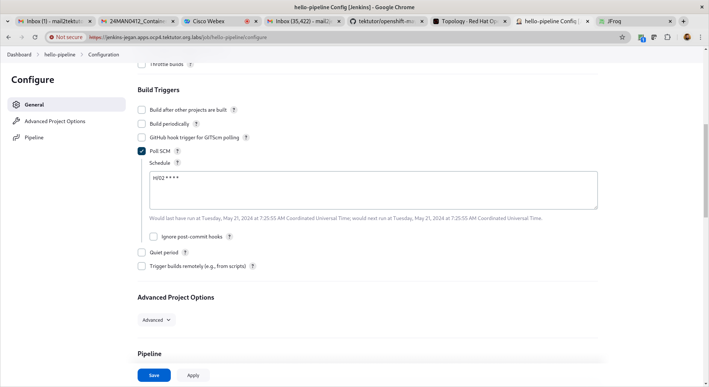
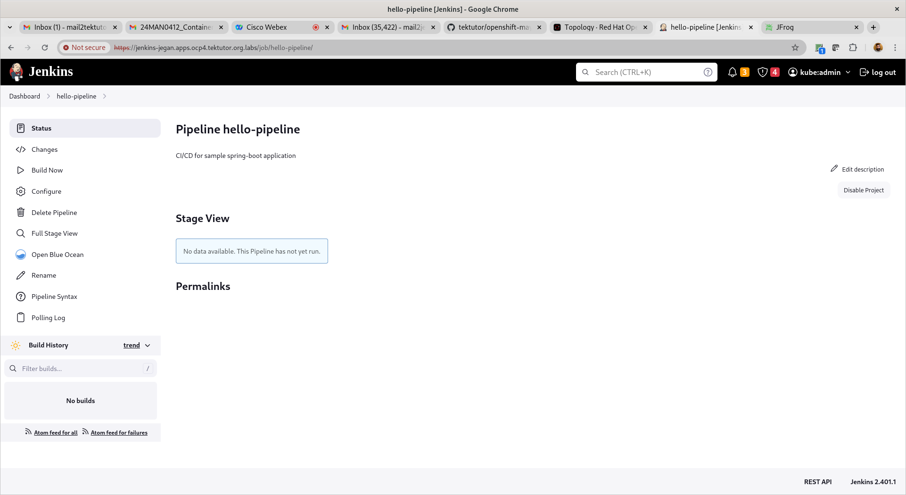

# Day 5

## Creating a Docker Registry in your JFrog Artifactory Cloud environment
Login to your JFrog Artifactory Cloud account


Switch to Administration Tab


Click on Repositories on the left side menu


Click on Create Repository menu on the top right corner


Click on Pre-built Setup


Select Docker


Type your name and click on create button


Click Continue button when you see a screen as shown in the screenshot below


Need to click on "Docker Client" Green arrow


Copy the instructions shown below in some text file and save it for your reference, click on Generate


Copy the token and save it in the same text file where you saved the previous instructions. Now, we need to execute the docker login instructions shown in the screen on your linux terminal using the token as the password


Click on Next button, copy the instruction shown below save it in text file and execute the instruction on your linux terminal


Click on Next button,copy the instruction in the text file and execute the pull and tag followed by push command


Click on Done and you will see the below page. You will notice 


## Lab - Build custom image with our application binary and push the image to JFrog Artifactory Docker Registry

Openshift need to login to JFrog Artifactry server in order to push the custom docker images, hence let's create a secret to store the JFrog Login Credentials in Openshift
```
oc create secret docker-registry private-jfrog-image-registry --docker-server=https://<your-jfrog-id>.jfrog.io --docker-username=<your-jfrog-registered-email> --docker-password=<your-jfrog-token>
secret/private-jfrog-image-registry created
```

Expected output


We need to create a buildconfig along with the jfrog credentials in the form of pushsecret as shown below


## Lab - Deploying hello microservice using our custom docker image from Private JFrog Docker Registry
```
cd ~/openshift-june-2024
git pull
cd Day5/buildconfig
oc create deployment hello --image=tektutorjegan74.jfrog.io/jegan-docker/hello-spring-microservice:1.0 --replicas=3 -o yaml --dry-run=client

oc create deployment hello --image=tektutorjegan74.jfrog.io/jegan-docker/hello-spring-microservice:1.0 --replicas=3 -o yaml --dry-run=client  > hello-deploy.yml
```

Update the hello-deploy to use your private-jfrog-image-registry secret as JFrog Artifactory will allow only authorized users to download and use the image from it.
```
cd ~/openshift-june-2024
git pull
cd Day5/buildconfig
cat hello-deploy.yml
oc apply -f hello-deploy.yml
oc get deploy,po
oc get po -w
oc get po
```

Expected output


Let's create an internal service for hello microservice
```
oc expose deploy/hello --type=ClusterIP --port=8080 -o yaml --dry-run=client
oc expose deploy/hello --type=ClusterIP --port=8080 -o yaml --dry-run=client > hello-svc.yml
oc apply -f hello-svc.yml
oc get svc
oc describe svc/hello
```

Expected output


Let's create a route to access the hello microservice from outside the openshift cluster
```
oc expose svc/hello -o yaml --dry-run=client
oc expose svc/hello -o yaml --dry-run=client > hello-route.yml

cat hello-route.yml

oc apply -f hello-route.yml
oc get route
oc describe route/hello
```
Expected output


## Lab - Rolling update - updating hello microservice to its v2.0
When the build config file is updated, we need to apply the changes in the openshift cluster
```
cd ~/openshift-june-2024
git pull
cd Day5/buildconfig
cat buildconfig-pushto-artifactory.yml
oc apply -f buildconfig-pushto-artifactory.yml
oc get buildconfigs
oc start-build bc/hello
```
Once the new image v2.0 is pushed successfully to JFrog Artifactory, you can proceed as shown bellow

```
oc set image deploy/hello hello=tektutorjegan74.jfrog.io/jegan-docker/hello-spring-microservice:2.0
oc get deploy/hello -o yaml | grep image
oc get route
curl http://hello-jegan.apps.ocp4.tektutor.org.labs
```

Expected output


## Lab - Deploy Jenkins Ephemeral in your Openshift project
Deploy Jenkins Ephemeral from Develop context and login to Jenkins


Select "pipeline" project








